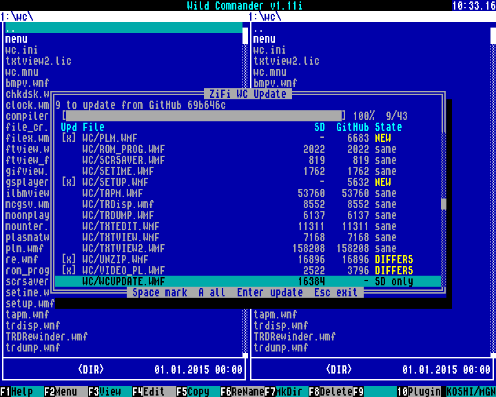

# ZiFi WC Update: проверка и обновление Wild Commander с GitHub

<p align="center">
  
</p>
<p align="center"><sub>Кадр эмулятора Unreal с Wild Commander v1.11i; список посчитан кодом прошивки для карты с WC v1.10i</sub></p>

Плагин `build/WCUPDATE.WMF` сверяет файлы Wild Commander Improved на SD-карте
с опубликованными на GitHub и обновляет те, что отличаются или отсутствуют, —
аналог `sfc /scannow` в Windows. Источник эталона —
[`andrewinsidelazarev/Wild-Commander-Improved`, каталог `exe`](https://github.com/andrewinsidelazarev/Wild-Commander-Improved/tree/main/exe)
ветки `main`.

Сверяется не CRC, а тот же SHA-1, которым GitHub подписывает каждый файл
(git blob SHA): совпадение означает, что на карте ровно опубликованный файл, а
не только файл той же длины. Файл читается с самой SD-карты, поэтому видно и
то, что записалось неверно или испортилось на карте позже.

## Как пользоваться

1. Скопируйте `WCUPDATE.WMF` в каталог плагинов WC и запустите его из меню `F10`.
   Нужен `/zifi/zifi.ini` с настройками Wi-Fi, как для FTP- и SMB-плагинов.
2. Плагин поднимает Wi-Fi и просит ESP проверить файлы. Список растёт по ходу
   проверки; полоса показывает долю прочитанных байтов.
3. Когда проверка закончена (в строке состояния — сколько файлов можно
   обновить), отметьте файлы и нажмите `Enter`.

| Клавиша | Действие |
|---|---|
| `↑` `↓` `PgUp` `PgDn` `Home` `End` | Перемещение по списку |
| `Пробел` | Поставить или снять отметку у файла и перейти ниже |
| `A` | Отметить все исполняемые файлы, которые отличаются или отсутствуют (`.WMF`, `.$C`, `.SPG`); тексты и совпавшие файлы не отмечаются |
| `Enter` | Обновить отмеченные; если ничего не отмечено — файл под курсором |
| `Esc` | Выход; идущее обновление останавливается после текущего шага (плагин дожидается остановки задачи на ESP) |

Окно — 19 строк, как у FTP-сервера, и влезает в любой текстовый режим WC
(80×25, 80×30, 90×36); в списке 14 строк. Удержанная стрелка прокручивает
список не быстрее, чем он перерисовывается, — каждый шаг виден целиком. А
короткое нажатие не теряется, даже пока окно рисуется: плагин забирает
клавишу у WC каждый кадр и применяет её, когда окно дорисовано. `Esc`
действует сразу, в том числе пока плагин ждёт ответа ESP на запуск проверки
или обновления.

Порядок строк: сам Wild Commander (`boot.$C`), затем плагины `*.WMF` по
алфавиту (и чужие, что есть только на SD), затем всё остальное по алфавиту.

Колонки списка: отметка, путь на карте, размер на SD, размер на GitHub и
состояние:

| Состояние | Значение |
|---|---|
| `same` | SHA совпадает с GitHub — делать ничего не нужно |
| `DIFFERS` | Отличается длиной или SHA — можно обновить |
| `NEW` | На GitHub есть, на карте нет (например, новый плагин) |
| `SD only` | Есть только на карте, внутри каталогов WC (например, плагины ZiFi) |
| `kept` | `wc.ini`: ваши настройки не перезаписываются |
| `READ ERR` | Файл не прочитался с карты — можно записать заново |
| `UPDATED` | Обновлён и проверен |
| `FAILED` | Обновить не удалось; отметка остаётся, `Enter` повторит. Причина последнего такого файла — в строке итога (`... failed: <причина>`) |

Если связь потеряла событие (строка не пришла или итог проверки), плагин
просит ESP выдать список заново — это видно только как короткая перерисовка.
Повтор принимается, только если пришёл весь, строка за строкой. После каждого
обновления (и после ошибки обновления) список запрашивается заново в любом
случае. Если повторить список не удалось и после пяти попыток, в строке
состояния — `ERROR: list not refreshed`: выйдите и запустите плагин снова.
Размеры больше 9 999 999 байт показываются в КиБ (`12056K`), 16 МиБ и
больше — `>16M`.

После обновления Wild Commander нужно перезапустить: сам WC и загруженные им
плагины уже в памяти, новые файлы он возьмёт при следующем старте. Строка
состояния напоминает об этом (`- restart WC`). Новый плагин, которого раньше
не было, WC загружает только из списка `[PLUGINS]` в `wc.ini`, а `wc.ini`
обновлятор не трогает: включите новый плагин в WC Setup (`F10` → WC Setup →
`Tab` — список плагинов → `Пробел`).

При переходе на
[Wild Commander Improved v1.11i от 28 сентября 2026 года](https://github.com/andrewinsidelazarev/Wild-Commander-Improved/releases/tag/v1.11i-2026-09-28)
новые и сам WC Setup (`SETUP.WMF`), и менеджер плагинов `PLM.WMF`, а
`boot.$C`, `FILEX.WMF` и `PLM.WMF` нужно обновить вместе (клавиша `A` отмечает
их все). До перезапуска WC добавьте в `[PLUGINS]` файла `wc.ini` строки
`PLM.WMF` и `SETUP.WMF` сразу за `FILEX.WMF`, в этом порядке (например,
редактором по `F4`): без них WC не загрузит ни менеджер плагинов, ни WC Setup.

## Как обновляется файл

Каждый шаг проверяется SHA, и старый файл удаляется только тогда, когда рядом
уже лежит копия, совпавшая с GitHub:

1. ESP скачивает файл с `raw.githubusercontent.com` того же коммита, по которому
   составлен список, и считает SHA. Не совпал — скачивает снова (до трёх раз).
2. Копия пишется на карту во временный `WCUPD.TMP` в каталоге файла.
3. ESP сверяет длину `WCUPD.TMP` по записи каталога, читает копию с карты
   обратно и считает SHA. Не совпало — пишет снова (до трёх раз). Так
   ловится и сбой записи, и плохая карта, и верное начало с лишним хвостом.
4. `WCUPD.TMP` встаёт на место файла одной операцией FILEX MOVE с заменой:
   Wild Commander перенаправляет запись файла на цепочку копии одной записью
   сектора, а при сбое возвращает прежнюю. Имя файла не пропадает ни на миг —
   и при пропадании питания на карте либо старый файл, либо новый.
5. Файл ещё раз читается с карты и сверяется. Не совпал — весь круг от
   скачивания повторяется.

Если WC сообщил сбой носителя или ответ потерялся, исход замены неизвестен:
файл всё равно читается и, если он верный, засчитывается, но копия не
удаляется (на её цепочку может остаться вторая ссылка), остальные файлы в
этом сеансе не пишутся, а в строке состояния — `check the disk`: карту стоит
проверить (`CHKDSK.WMF`) и запустить обновление снова.

WC без FILEX MOVE (старое ядро) обслуживается запасным путём: прежний файл
откладывается под именем `WCUPD.OLD`, копия получает имя файла, и только
потом отложенный удаляется. Любой отказ переименования здесь считается
неизвестным исходом: даже у WC Improved код отказа бывает и после того, как
запись каталога уже изменилась. Поэтому ни одна копия не удаляется (прежний
файл, если он уже отложен, возвращается на имя), запись в сеансе
прекращается, в строке состояния — `rename failed: CHKDSK`. Если не удалился
сам `WCUPD.OLD`, файл обновлён, но в этот каталог плагин больше не пишет.

Остатки прерванной замены (`WCUPD.TMP`, `WCUPD.OLD`) плагин не показывает и
не удаляет: после сбоя носителя такой остаток может делить кластеры с самим
файлом. Опись ищет их и в листинге каталога, и прямым запросом по имени
(ошибка чтения посреди каталога для WC выглядит его концом). Найдя остаток,
плагин не пишет в этот каталог (строка файла — `FAILED`, в итоге —
`CHKDSK: old WCUPD.*`). Перед записью копии имя `WCUPD.TMP` проверяется, а
открыть его на запись плагин может, только если оно свободно: занятое имя —
отказ, прежний файл с этим именем не удаляется, даже если опись его не
увидела. Каталог, который опись сочла отсутствующим, а при записи он нашёлся,
— признак ошибок чтения карты: запись в сеансе прекращается
(`SD read errors: CHKDSK`). Проверьте карту (`CHKDSK.WMF`), разберитесь с
остатком (в `WCUPD.OLD` — прежняя версия файла, в `WCUPD.TMP` — новая) и
запустите обновление снова.

`wc.ini` не перезаписывается никогда. Его ставят с GitHub только тогда, когда
на карте его нет вовсе: без него WC не запустится. Если при записи он всё же
нашёлся (например, прошлая попытка его поставила, а проверка чтением не
прошла), он только сверяется.

## Что где выполняется

Всю работу ведёт ESP32-S3: запросы к GitHub API (коммит ветки и рекурсивный
список каталога), SHA-1, скачивание, запись и чтение файлов через файловые
запросы к плагину. Z80 отвечает на файловые запросы теми же модулями, что у
FTP-плагина, показывает список и отдаёт ESP номера отмеченных строк. Команды и
события описаны в [протоколе](../docs/PROTOCOL.md) (`WCU_START`, `WCU_APPLY`,
`WCU_STOP`, `WCU_SYNC`, события `67` и `68`).

Карта читается через UART 115200, порядка 10 КиБ/с, поэтому проверка полного
набора (около 0,8 МБ) занимает порядка полутора минут. Файлы другой длины
считаются отличающимися без чтения.

На время работы плагин включает 14 МГц (API 14 `TURBOPL`, как по умолчанию в
WC: `CPU_FREQ=2`) и при выходе возвращает частоту из настроек WC. У ZiFi нет
управления потоком, а очередь приёма — 256 байт: на 3,5 МГц разбор сплошного
потока событий не успевает за линией 115200, и очередь переполняется. Окно
перерисовывается по одной строке и только когда очередь пуста; модель линии
в тестах на 14 МГц даёт пик очереди около 20 байт из 256.

## Ограничения

- До 96 файлов в каталоге на GitHub; список GitHub API длиннее 64 КиБ или
  урезанный (`truncated`) считается ошибкой, а не частичным списком.
- GitHub без авторизации даёт 60 запросов API в час с одного адреса; проверка
  тратит два. При исчерпании в строке состояния — `GitHub API limit, retry later`.
- Проверяется корень той SD-карты, на которой найден `/zifi/zifi.ini`.
- Замена одной записью каталога требует FILEX MOVE (Wild Commander
  Improved); со старым ядром замена идёт двумя переименованиями и удалением
  через `WCUPD.OLD`, и при пропадании питания посередине файл может остаться
  под этим именем.
- Каталоги, которых нет на GitHub, не просматриваются; чужие файлы
  показываются только в каталогах эталона.
- Если ESP не остановила задачу за три попытки STOP (около минуты), плагин
  всё равно выходит; FTP и SMB до её завершения не запустятся.

## Требования

- ZX Evolution с TS-Config, ZiFi на ESP32-S3 Zero;
- прошивка ESP `s3-native-0.6.94` с командами обновлятора (старая прошивка
  ответит `ERROR: unsupported:25`);
- Wild Commander Improved;
- `/zifi/zifi.ini` с доступом Wi-Fi в интернет.

## Сборка

```powershell
& ".\WC Update\build.bat"
```

Результат: `WC Update/build/WCUPDATE.WMF`. Общие файлы берутся из `shared/z80`,
файловые модули `vfs.asm` и `fs.asm` — из `FTP Server/src`. Плагин занимает три
страницы: код, окно записи 16 КиБ для файловых модулей и таблицу списка.

Тесты:

```powershell
python -m unittest tests\test_wc_update_z80.py
python -m unittest tests\test_wc_update_host.py tests\test_wc_json.py
```

Первый исполняет плагин в эмуляторе Z80 со страницами памяти, экраном и
клавишами WC; второй собирает настоящий обновлятор прошивки на ПК
(`tools/host_wcu`) с эмулятором WC поверх папки и «GitHub» из папки, с помехами
при скачивании, записи, чтении, переименовании и удалении и с ошибками чтения
каталогов.
