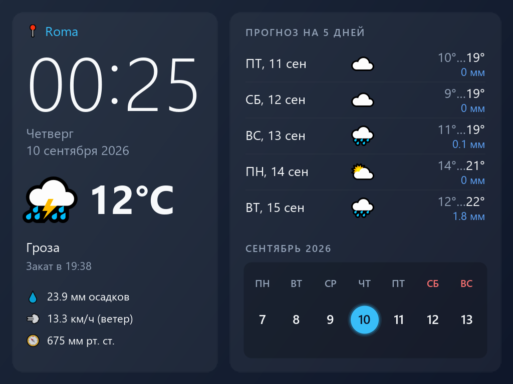

# ZiFi Weather 2 — заставка Wild Commander для VDAC2

<p align="center">
  
</p>
<p align="center"><sub>Кадр FT812, нарисованный по дисплей-листу, который собрал код плагина в машинном тесте</sub></p>

[`build/WEATHER2.WMF`](build/WEATHER2.WMF) — та же заставка с погодой и
календарём, что [`WEATHER.WMF`](../Weather%20screensaver), но для платы
VDAC2: экран рисует видеочип FT812 в режиме 1024×768 @ 59 Гц, со сглаженным
текстом и полупрозрачными панелями, как в макете
[`index.html`](../Weather%20screensaver/index.html).

- слева — место, крупные часы с мигающим двоеточием, день недели и дата,
  текущая погода (иконка, температура, описание, время заката), осадки,
  ветер и давление;
- справа — прогноз на 5 дней и лента текущей недели: суббота и воскресенье
  красным, сегодняшний день — голубой круг ровно вокруг числа.

Любая клавиша закрывает заставку; нажатие не доходит до панелей WC. Без платы
VDAC2 заставка сразу возвращается в WC — на таком компьютере ставьте
`WEATHER.WMF`.

## Установка

1. Скопируйте `WEATHER2.WMF` в каталог `/WC` на SD-карте.
2. В `WC/wc.ini` добавьте строку `WEATHER2.WMF` в секцию `[PLUGINS]`, а в
   `[SETUP]` задайте время бездействия `ScreenSaver=1`…`9` (минуты). Wild
   Commander запускает первый в `[PLUGINS]` плагин-заставку (тип `#02`), так
   что `WEATHER.WMF` и `WEATHER2.WMF` вместе не нужны. Вручную заставку
   можно открыть из меню плагинов F10 («ZiFi Weather 2 (VDAC2)»).
3. В `/zifi/zifi.ini` — город по-английски и код страны, как у
   `WEATHER.WMF`:

   ```ini
   city: Rome
   country: IT
   ```

   Прежняя запись `country:` + `zip:` (почтовый индекс) тоже работает.
4. Нужна прошивка ZiFi `s3-native-0.6.93` или новее (обновляется плагином
   [`ZIFIUPD.WMF`](../Online%20Update/build/ZIFIUPD.WMF)): в ней есть команда
   `WEATHER_GET` с поиском по городу, см. [`docs/PROTOCOL.md`](../docs/PROTOCOL.md).

Погода запрашивается при запуске, раз в час и при смене дня; после неудачи —
через 10, 20, 30, 60, 120 секунд и дальше каждые 5 минут. Всё это — общий
с `WEATHER.WMF` код из [`shared/weather`](../shared/weather), подробности — в
[описании `WEATHER.WMF`](../Weather%20screensaver/README.md).

## Как это устроено

FT812 — не «экран в памяти»: он собирает картинку каждый кадр по
дисплей-листу, программе из 32-битных команд, а шрифты и иконки держит в
своей памяти RAM_G (1 МиБ). Z80 говорит с ним по SPI через Z-контроллер —
тот же, что обслуживает SD-карту (порт `#77` бит 2 выбирает FT812, `#57` —
обмен).

1. Запуск чипа в 1024×768 @ 59 Гц: частота точек 64 МГц, строка 1344 такта,
   кадр 806 строк — те же тайминги, что у Zuma и HMM2 на VDAC2.
2. Шрифты (Segoe UI, 16 уровней сглаживания) и цветные иконки Segoe UI Emoji
   занимают в RAM_G 613 КБ; в плагине они лежат сжатыми zlib (53 КБ), и
   распаковывает их сам сопроцессор чипа командой `CMD_INFLATE`.
3. Кадр — один дисплей-лист: готовый неизменный блок (фон, панели, заголовки)
   и изменяемая часть, которую Z80 пишет по времени и погоде. Лист собирается
   заново, когда что-то поменялось, — раз в секунду из-за двоеточия.
4. Монитор переключается на FT812 функцией WC 66 (`GVmod`, режим `#04`): WC
   сам держит этот режим каждый кадр, а при выходе возвращает свой экран.

## Сборка

```bat
"Weather screensaver VDAC2\build.bat"
```

Нужны Python 3 с Pillow и sjasmplus. `tools/gen_assets.py` растрирует шрифты
и иконки для FT812, сжимает образ RAM_G, раскладывает страницы данных и
генерирует `src/*.inc`; размеры, цвета и раскладка — в `tools/design.py`,
строки и таблица погоды — общие с `WEATHER.WMF`.

## Проверка

```bat
python -m pip install pillow z80
"Weather screensaver VDAC2\build.bat"
cd "Weather screensaver VDAC2"
python -m unittest discover -s tests -v
```

Плагин исполняется в эмуляторе Z80 на общем стенде
([`shared/weather/harness.py`](../shared/weather/harness.py)), а порты SPI
подключены к настоящему FT812 — эмулятору чипа `bt8xxemu.dll` от Bridgetek
(тот же, что показывает VDAC2 в Unreal Speccy). Каталог с DLL задаёт
переменная `BT8XXEMU_DIR`. Проверяется, что поток команд, записанный кодом
Z80, байт в байт совпадает с эталоном `tools/refscene.py`, а кадр чипа — с
кадром эталона: полный экран, мигание двоеточия, работа без ZiFi, доклад
ошибки ESP, «Запрос погоды…», повтор после ответа 503, смена дня, второй
запуск заставки и выход без платы VDAC2.

## Устройство

| Файл | Назначение |
|---|---|
| `src/main.asm` | вход плагина, подключение модулей |
| `src/ft812.asm` | SPI, запуск FT812, очередь сопроцессора, загрузка ресурсов |
| `src/video.asm` | экран FT812 через API WC, страницы данных |
| `src/screen.asm` | сборка дисплей-листа, зеркало `tools/refscene.py` |
| `tools/design.py` | цвета, шрифты и раскладка 1024×768 |
| `tools/gen_assets.py` | шрифты, иконки, образ RAM_G, таблицы → страницы и `src/*.inc` |
| `tools/refscene.py` | эталонный поток команд экрана и кадр чипа (`build/preview.png`) |
| `tools/ft812emu.py`, `tools/eve.py` | FT812 из Python, кодировщики команд |
| `tools/prepare_unreal.py` | стенд в эмуляторе Unreal с VDAC2 и моделью ESP |
| `screenshot.png` | снимок экрана для этого описания |

Память: код — страница 0 плагина в `#8000`; таблицы шрифтов, неизменный блок
кадра и сжатые ресурсы — страницы 1–4, подключаются к `#0000` (API 78). При
выходе WC вызывает `GEDPL`, который портит `#1000..#1447` страницы в окне
`#0000`, поэтому перед выходом подключается страница 4 — у неё этот участок
пуст.
